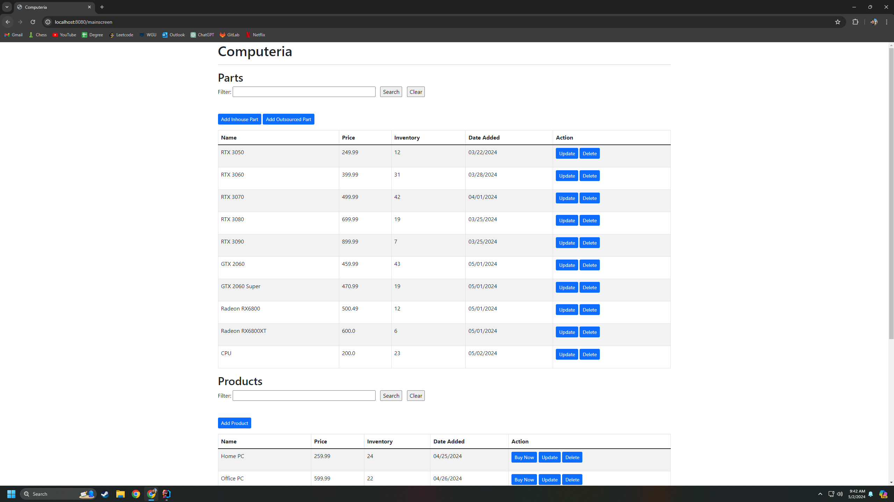
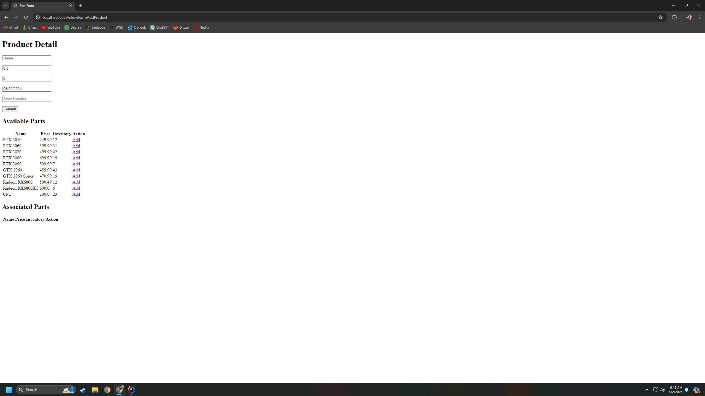
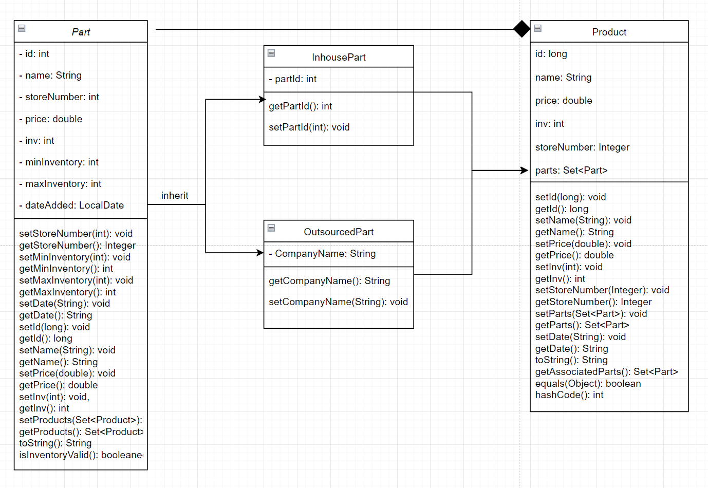
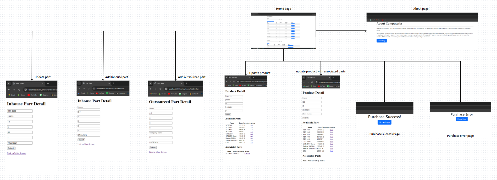
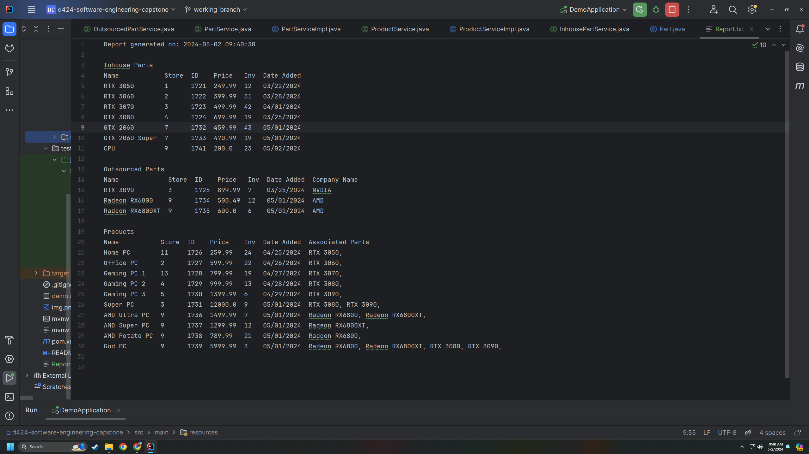
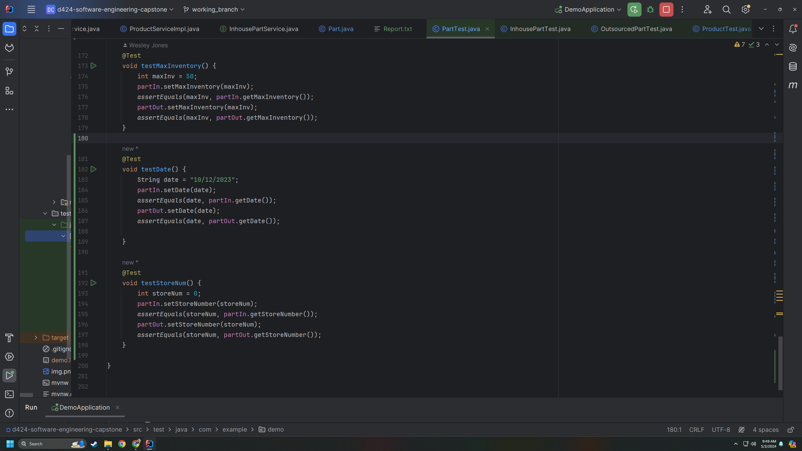
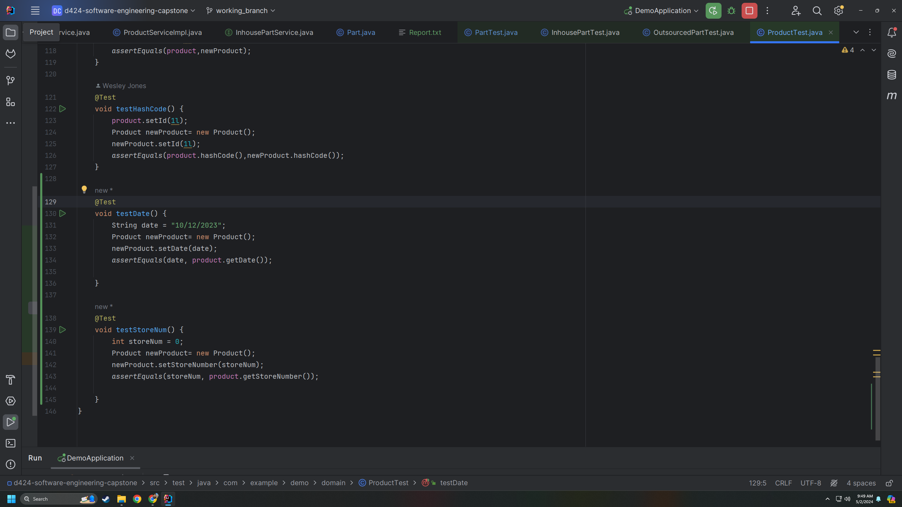
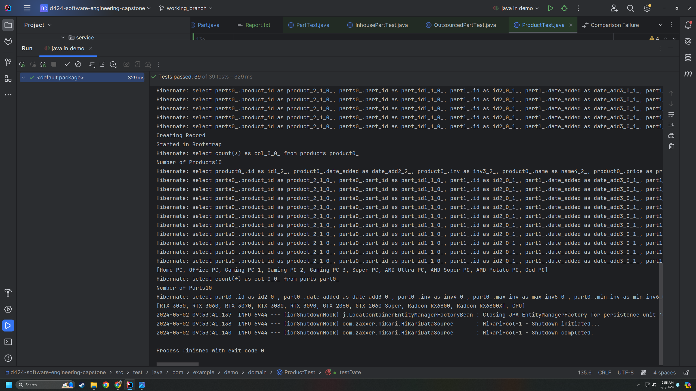

## Computeria Capstone Project

### Home Page

The Computeria inventory management system is a software solution designed to streamline and optimize inventory management processes for Computeria, 
a well-established computer store. The system focuses on managing the inventory of hardware components, peripherals, and complete PC systems sold by Computeria.

## Features

- Ability to Create, Edit and Delete Products and Parts.
- Add Multiple Parts to a Product
- Error Handling
- Back End Database
- Search Functionality
- Report Generation

#### Add Product Screen

#### Class diagram

#### Design diagram

The link to the application is [http://wesleyjonestask3-env.eba-qmid2mur.us-east-2.elasticbeanstalk.com/mainscreen](http://wesleyjonestask3-env.eba-qmid2mur.us-east-2.elasticbeanstalk.com/mainscreen)

How a user should run the application.

To run the application on your machine. download the project onto your machine into Intellij from Gitlab, 
here is the [link.](https://gitlab.com/wgu-gitlab-environment/student-repos/wjon249/d424-software-engineering-capstone.git)
Click the Run 'DemoApplication' button at the top.  Once the application has finished building, 
open a web browser and go to [localhost:5000/mainscreen](http://localhost:5000/mainscreen)

If you want to reset the database,open the BootStrapData.js file located in src/main/java/com/example/demo/bootstrap/BootStrapData.java.  Go to 
line 43-46 and un comment the code, then re-run the application and the database will be set to its original state.

## Generated report
To see the report of parts and products that were created when the application first ran, open the Report.txt file located in the root directory. 

## Test Plan for Unit Testing

**Objective:** To test the functionality of the `Part` and `Product` classes to make sure that they perform properly.to do 
this, run the tests by right-clicking the java file located at src/test/java and click the Run 'Tests in java button'
The unit tests that we used are located at src/test/java/com/example/demo

### Test Cases

1. **For `Part` class:**
    - Test getting and setting ID.
    - Test getting and setting name.
    - Test getting and setting price.
    - Test getting and setting inventory.
    - Test getting and setting products.
    - Test `toString` method.
    - Test `equals` method.
    - Test `hashCode` method.
    - Test getting and setting minimum inventory.
    - Test getting and setting maximum inventory.
    - Test getting and setting date added.
    - Test getting and setting store number.

2. **For `Product` class:** (similar to `Part` class tests)

### Test Procedure
Set attributes, call methods, and assert expected results.

#### Part tests

#### Product tests

#### Tests ran successfully

### Summary of Changes
No changes were made to the original methods and classes because of the testing.
